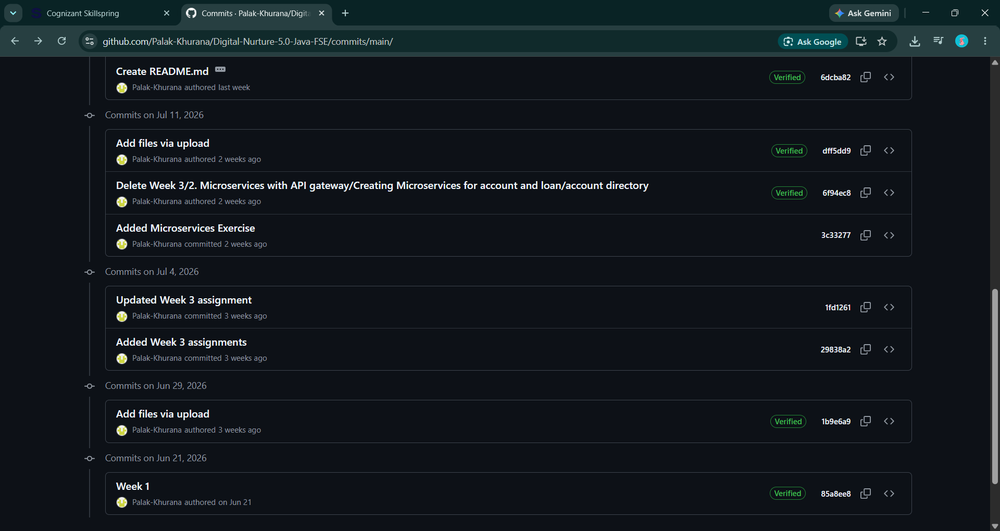
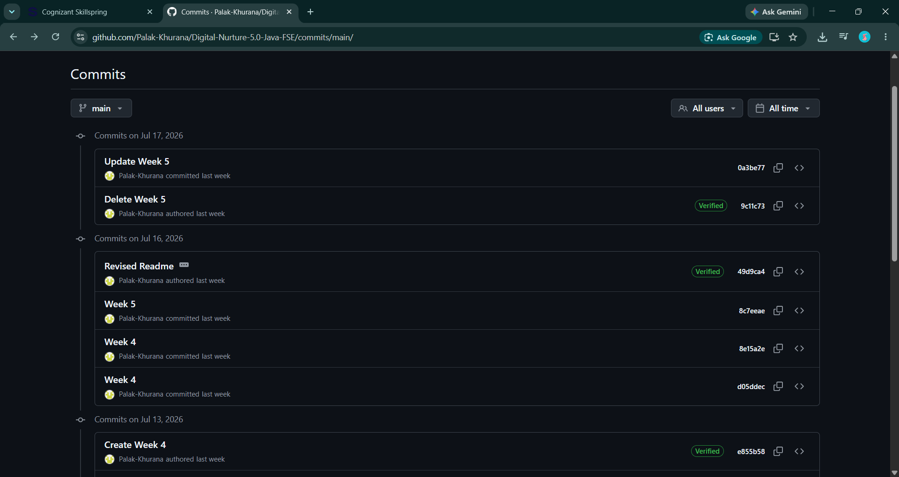

# 📚 Cognizant Digital Nurture 5.0 - Java FSE

This repository contains my solutions for the **Cognizant Digital Nurture 5.0 - Java Full Stack Engineer (Java FSE)** program.

## ✅ Completed Exercises

| Module | Folder | Exercise |
|--------|--------|----------|
| **Design Principles & Patterns** | Design Patterns and Principles | ✅ Exercise 1: Implementing the Singleton Pattern |
| | | ✅ Exercise 2: Implementing the Factory Method Pattern |
| **Data Structures & Algorithms** | Algorithms_Data Structures | ✅ Exercise 2: E-commerce Platform Search Function |
| | | ✅ Exercise 7: Financial Forecasting |
| **PL/SQL Programming** | PLSQL_Exercises | ✅ Exercise 1: Control Structures |
| | | ✅ Exercise 3: Stored Procedures |
| **TDD using JUnit5 & Mockito** | JUnit Basic Testing Exercises | ✅ Exercise 1: Setting Up JUnit |
| | | ✅ Exercise 3: Assertions in JUnit |
| | | ✅ Exercise 4: Arrange-Act-Assert (AAA) Pattern, Test Fixtures, Setup and Teardown Methods in JUnit |
| | Mockito Exercises | ✅ Exercise 1: Mocking and Stubbing |
| | | ✅ Exercise 2: Verifying Interactions |
| **SLF4J Logging Framework** | SLF4J Logging Exercises | ✅ Exercise 1: Logging Error Messages and Warning Levels |
| **Spring Core & Maven** | Spring Core_Maven | ✅ Exercise 1: Configuring a Basic Spring Application |
| | | ✅ Exercise 2: Implementing Dependency Injection |
| | | ✅ Exercise 4: Creating and Configuring a Maven Project |
| **Spring Data JPA with Spring Boot & Hibernate** | spring-data-jpa-handson | ✅ Spring Data JPA - Quick Example |
| | | ✅ Difference between JPA, Hibernate and Spring Data JPA |
| **Spring REST using Spring Boot 3** | spring-rest-handson | ✅ Create a Spring Web Project using Maven |
| | | ✅ Spring Core – Load Country from Spring Configuration XML |
| | | ✅ Hello World RESTful Web Service |
| | | ✅ REST - Country Web Service |
| | | ✅ REST - Get Country Based on Country Code |
| | JWT-handson | ✅ Create Authentication Service that Returns JWT |
| **Microservices with Spring Boot 3 & Spring Cloud** | Microservices with API Gateway | ✅ Creating Microservices for Account and Loan |
|| **React.js**                                        | ReactJS-HOL                    | ✅ Hands-on 1                                                                                       |
|                                                     |                                | ✅ Hands-on 2                                                                                       |
|                                                     |                                | ✅ Hands-on 3                                                                                       |
|                                                     |                                | ✅ Hands-on 4                                                                                       |
|                                                     |                                | ✅ Hands-on 5                                                                                       |
|                                                     |                                | ✅ Hands-on 9                                                                                       |
|                                                     |                                | ✅ Hands-on 10                                                                                      |
|                                                     |                                | ✅ Hands-on 11                                                                                      |
|                                                     |                                | ✅ Hands-on 12                                                                                      |
|                                                     |                                | ✅ Hands-on 13                                                                                      |

---

## 📊 Progress

- ✔️ Design Principles & Patterns
- ✔️ Data Structures & Algorithms
- ✔️ PL/SQL Programming
- ✔️ TDD using JUnit5 & Mockito
- ✔️ SLF4J Logging Framework
- ✔️ Spring Core & Maven
- ✔️ Spring Data JPA with Spring Boot & Hibernate
- ✔️ Spring REST using Spring Boot 3
- ✔️ Microservices with Spring Boot 3 & Spring Cloud
- ✔️ React.js (Hands-on 1–5)

---

## 🚀 Repository Structure

```text
📦 Digital-Nurture-5.0-Java-FSE
├── Design Patterns and Principles
├── Algorithms_Data Structures
├── PLSQL_Exercises
├── JUnit Basic Testing Exercises
├── Mockito Exercises
├── SLF4J Logging Exercises
├── Spring Core_Maven
├── spring-data-jpa-handson
├── spring-rest-handson
├── JWT-handson
├── Microservices with API Gateway
└── ReactJS-HOL
```

---
## 📈 Progress Snapshot

<p align="center">
  
  
</p>

**Status:** 🚀 Exercises completed till the latest submission. More exercises will be added as the training progresses.
